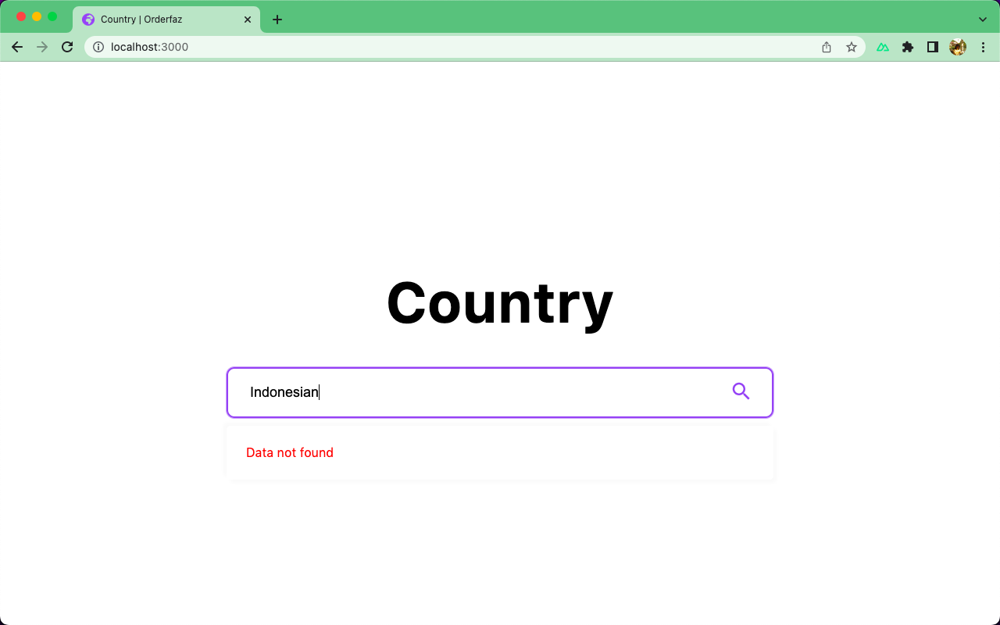
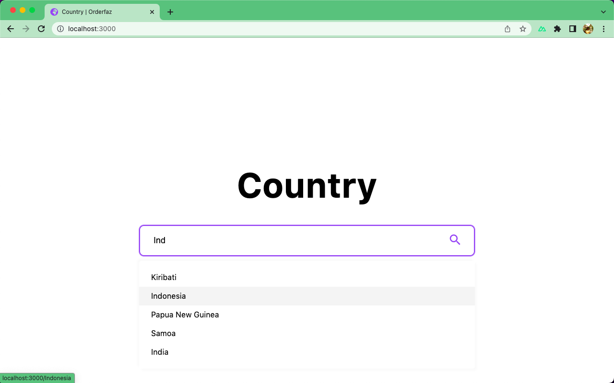
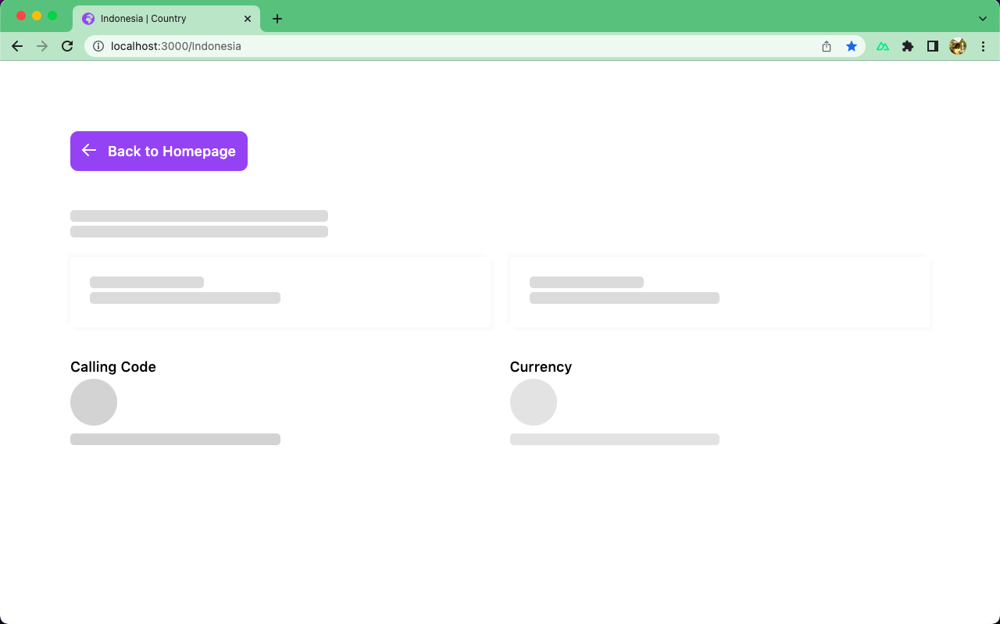
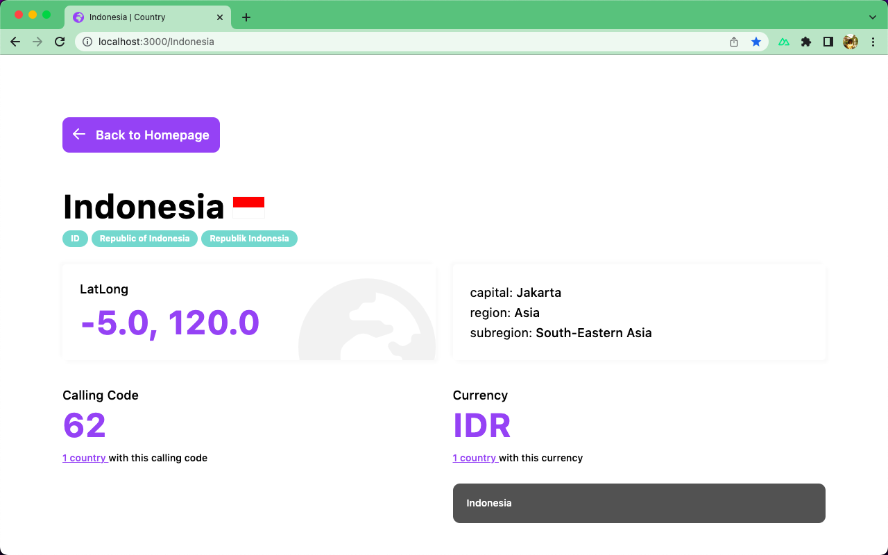

# country-orderfaz

## Instructions for running the project

```bash
# ***********************************************************
# *                                                         *
# *     If you get an error, please try node v14.19.3       *
# *                                                         *
# ***********************************************************

# clone the repository first using terminal or others
$ git clone https://github.com/kamera846/country.git

# navigate the directory to the cloned repository, maybe like this
$ cd country-orderfaz

# install all the dependencies that the project needs 
$ npm install

# run the project and access it via the following link localhost:3000
$ npm run dev
```

# Preview Project Country Search Engine

### Empty State


### Search Engine


### Loading State (Improve Case)


### Detail Country
